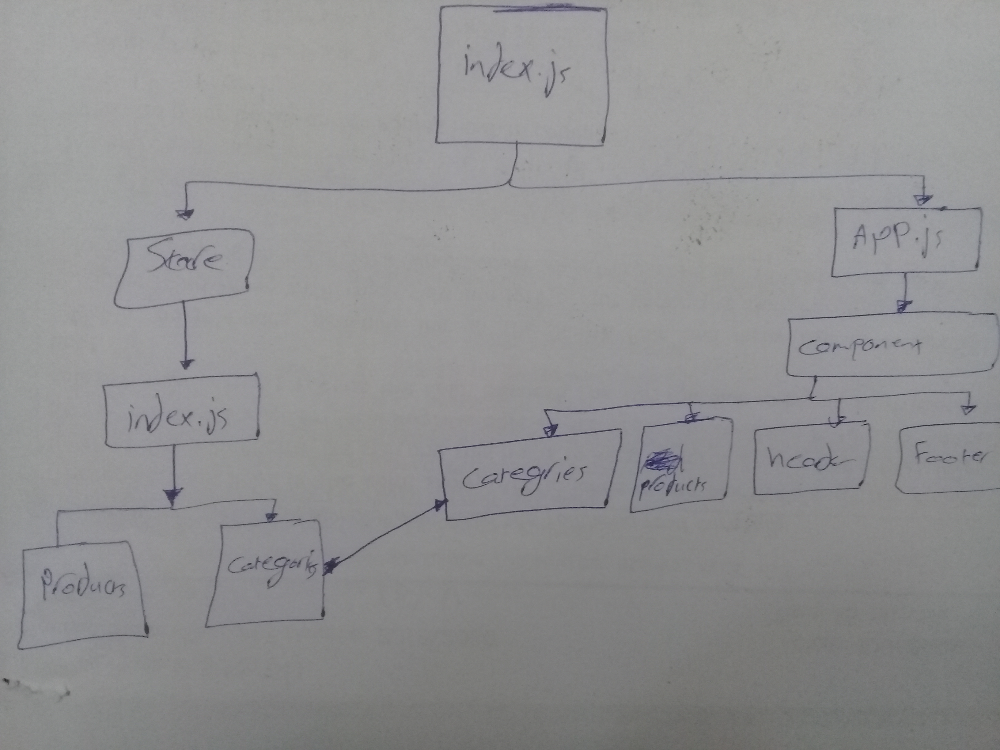

# Project: Storefront

## Phase 1
**Virtual Store Phase 1: For this assignment, you will be starting the process of creating an e-Commerce storefront using React with Redux, coupled with your live API server**

## Author: Hammad Ali

## Setup

* npm install

### How to initialize/run this application
* npm start 

## UML
